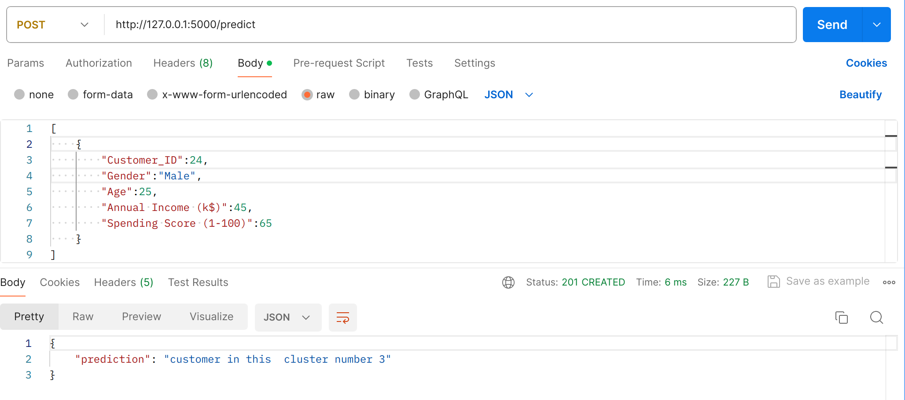

## Clustering for mall customers dataset

In this project we have mall customer dataset and done clustering
on this(using kmeans algorithm).

clone GitHub repository
```bash
    https://github.com/Gauravkumar8898/assignment-14.git
```

Install dependencies.
``` bash
pip install -r requirements.txt
```
for prediction and training model
``` bash
python main.py
```


### Screenshot
